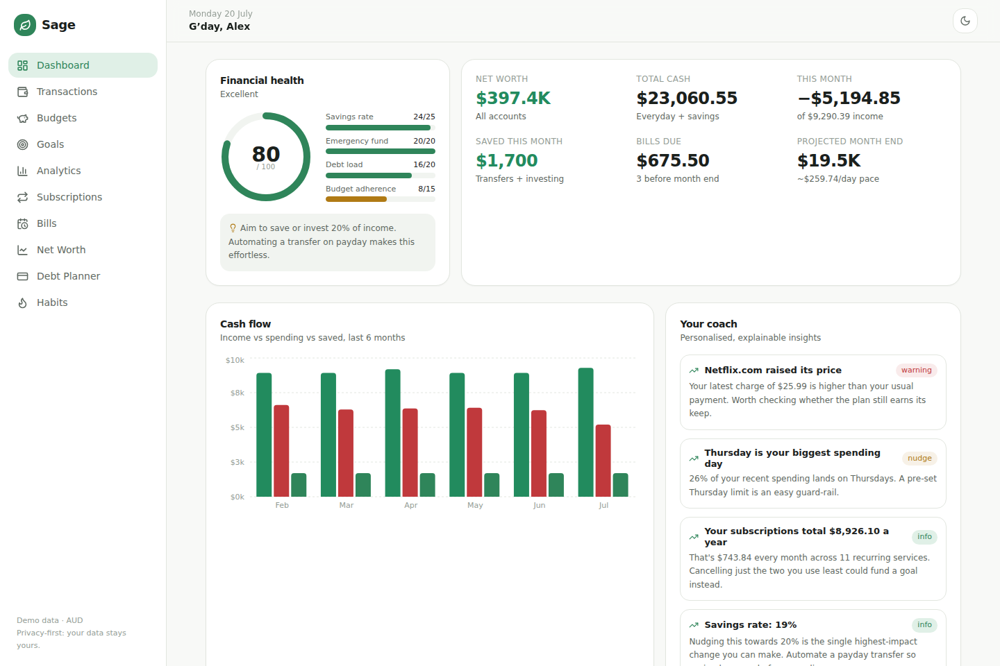
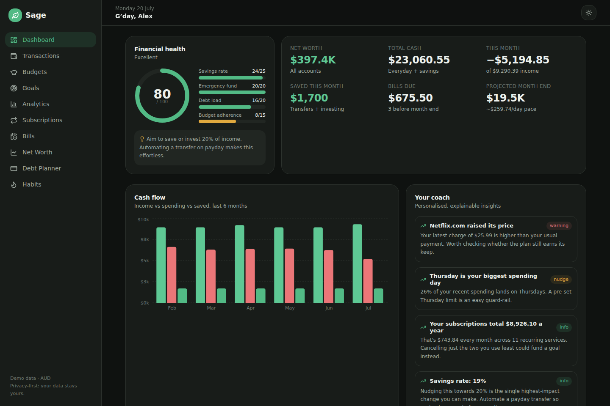

# Sage — Money, mastered 🌿

A premium personal finance platform built to **change financial behaviour**, not just track it: spend smarter, save more, invest consistently, reduce debt, and build lasting wealth. Australian-first, privacy-first.

This repository contains the production-shaped web application (Next.js App Router) plus the full product documentation set. The mobile apps (React Native / Expo) share the same domain engines — see `docs/ARCHITECTURE.md`.

| Light | Dark |
| --- | --- |
|  |  |

## What's implemented

| Area | Highlights |
| --- | --- |
| **Dashboard** | Financial Health Score (6 explainable pillars), net worth, cash flow chart, month-end forecast, bills due, budgets, goals, subscriptions, AI-coach insights, recent activity |
| **Transactions** | Search/filter, manual entry with auto-categorisation, user-trainable rules engine ("MCD" → Fast Food) that retro-applies |
| **Budgets** | Category budgets with pro-rata "on track" pacing, month-progress marker, four budgeting methods |
| **Goals** | Progress, predicted completion date, probability of success, one-tap boosts |
| **Analytics** | Trends, category donut, weekday profile, calendar heat map, largest purchases, merchant analysis |
| **Subscriptions** | Automatic detection from transaction patterns (amount + interval stability), price-increase alerts, true annual cost |
| **Bills** | Due dates, autopay status, late-fee warnings |
| **Net worth** | Full asset/liability breakdown incl. property & super, growth chart |
| **Debt planner** | Month-by-month snowball vs avalanche simulation, interest saved, payoff order |
| **Habits & gamification** | Streaks, XP, levels, savings challenges |
| **AI Coach** | Deterministic, explainable insight engine (category momentum, day-of-week patterns, late-night spending, subscription load, savings-rate feedback) — designed for an LLM conversational layer on top |
| **Import & Sync** | Bank-provider abstraction with demo CDR feed; CSV import with automatic layout detection (CBA/ING/signed formats), preview, and duplicate reconciliation — every input path shares one ingestion pipeline |
| **Notifications** | Live-derived notification centre (bill due, budget exceeded, large purchase, salary received, goal milestones, price rises, low balance) with header badge |
| **Reports & exports** | Monthly report with MoM category comparison, print-to-PDF, full CSV/JSON data exports |
| **Auth & multi-user** | Register/login with scrypt + signed httpOnly sessions, per-user data isolation, one-tap demo access (`alex@example.com` / `demo1234`) |
| **Investments** | Holdings with returns, asset-class allocation, dividend history |
| **Tax Centre** | AU financial-year deduction tracking, one-tap flagging, EOFY CSV export |
| **Challenges** | Join/claim savings challenges judged live from real transactions |
| **Sage Coach chat** | Conversational Q&A grounded in the real engines — affordability checks against safe-to-spend, goal what-ifs, payday plans — with a provider seam for the Claude layer |
| **Safe to spend** | The one number that answers "can I spend right now?": cash − upcoming bills − remaining goal commitments, fully itemised |
| **Receipts** | Attach photos/PDFs to transactions behind a storage abstraction (local → S3/R2), auth-checked serving |
| **Household mode** | Invite-code households with per-account sharing — privacy enforced in the engine, combined finances, per-member contributions (partner login: `sam@example.com` / `demo1234`) |
| **Money Date** | Guided weekly review ritual (wins → watch-outs → plan) computed from live data, ending in a logged streak |
| **Production-ready** | Dockerfile + compose with Postgres, schema drift guard in CI, health endpoint, [deployment guide](docs/DEPLOYMENT.md) |

All domain logic lives in pure, unit-tested modules under `src/lib/domain/` — shared verbatim with mobile and background jobs.

## Getting started

```bash
npm install
cp .env.example .env
npm run db:reset      # creates SQLite db + seeds 8 months of realistic AU data
npm run dev           # http://localhost:3000
```

Sign in with the demo account (`alex@example.com` / `demo1234`), use the one-tap
"Explore the demo" button, or register a fresh account of your own.

Other commands: `npm test` (31 domain tests), `npm run e2e` (Playwright smoke suite — build first), `npm run typecheck`, `npm run build`.

## Repository layout

```
docs/                  PRD, architecture, design system, security, roadmap
prisma/                schema (SQLite dev / Postgres prod) + deterministic seed
src/lib/domain/        pure engines: categorise, recurring, healthScore,
                       forecast, debt, insights, money (+ tests)
src/lib/               data access (data.ts), server actions, Prisma client
src/components/        UI primitives, charts, app shell
src/app/               one route per feature area
```

## Documentation

- [Product Requirements (PRD)](docs/PRD.md) — personas, competitor analysis, feature spec
- [Architecture](docs/ARCHITECTURE.md) — stack trade-offs, Open Banking (CDR) integration, mobile strategy, scaling path
- [Design system](docs/DESIGN-SYSTEM.md) — tokens, principles, accessibility
- [Security & privacy](docs/SECURITY.md)
- [Deployment](docs/DEPLOYMENT.md) — Docker/Postgres and Vercel paths, production checklist
- [Roadmap](docs/ROADMAP.md) — phased build order and future features
